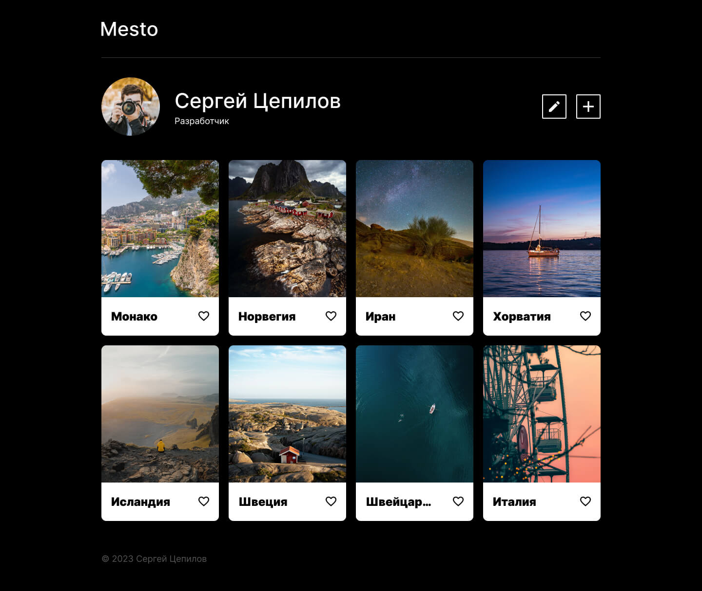

# Вёрстка: Место

## Работа с макетом в Figma:
- Задание на верстку в виде [макета](https://www.figma.com/file/vNujtzsvef1hUMttko61U1/%D0%92%D1%91%D1%80%D1%81%D1%82%D0%BA%D0%B0%3A-%D0%9C%D0%B5%D1%81%D1%82%D0%BE?type=design&node-id=7%3A2&mode=design&t=Noza6cGvYDWLuuzl-1).

## Скриншот:

  
Развернуть

  &nbsp;
  

